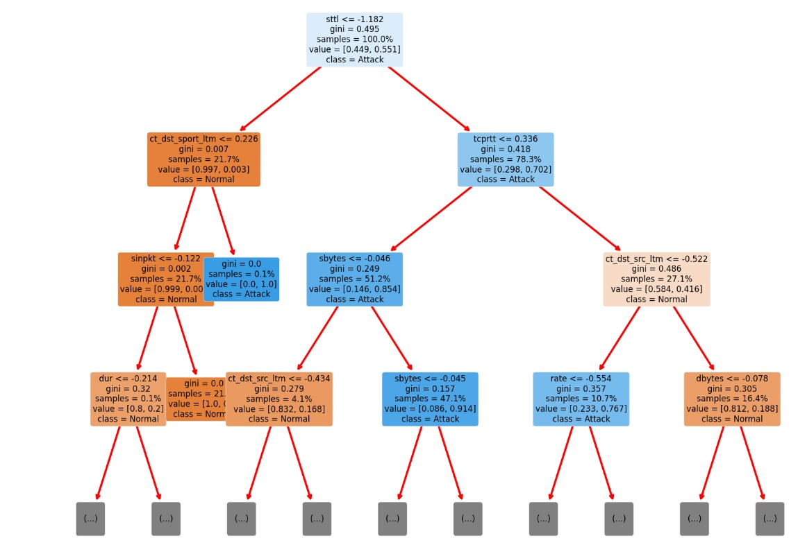
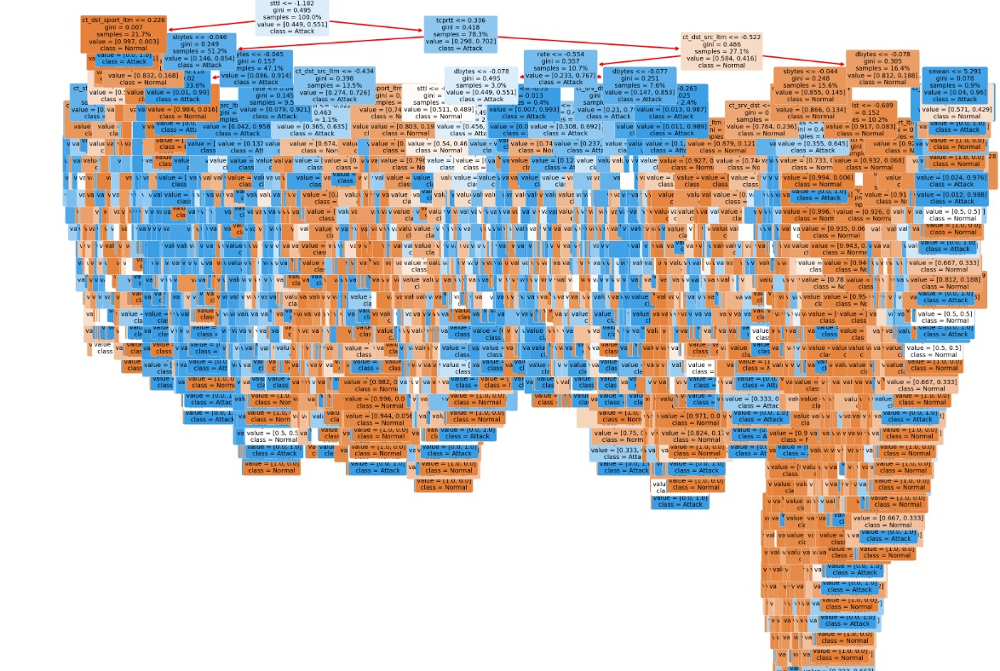

# Network Intrusion Detection System using Explainable AI

## Overview
This project implements a Network Intrusion Detection System (NIDS) using Explainable AI techniques. The system leverages the Lime library for explainability and incorporates various machine learning models such as decision trees, MLP classifiers, random forests, and XGBoost.

## Features
- Detection of network intrusions using machine learning algorithms.
- Explainable AI capabilities using Lime library to interpret model decisions.
- Integration with Jupyter Notebook for development and testing.
- Detailed documentation covering system design, implementation, testing, and results.

## Project Structure
The project is organized into the following components:
- `src/`: Contains the source code for the NIDS system.
- `data/`: Includes datasets and any necessary data files.
- `models/`: Stores trained machine learning models.
- `docs/`: Documentation related to the project.

## Technical Details
- Programming Languages: Python, SQL
- Libraries/Frameworks: Lime, Jupyter Notebook, XGBoost, scikit-learn
- Tools: Decision tree visualization tools
- Database: [Specify if any]

## Usage
1. Clone the repository: `git clone https://github.com/your_username/network-intrusion-system.git`
2. Install dependencies: `pip install -r requirements.txt`
3. Train the model using the provided datasets.
4. Run the NIDS system and evaluate its performance.
5. Refer to the documentation in `docs/` for more detailed instructions.

## Screenshots
### Decision Tree Visualization
#### 1. First Decision Tree (img1.jpg)

#### 2. Node Structure of Decision Tree (img2.jpg)

## Parameters Used
The NIDS system utilizes the following parameters:
- Feature selection criteria (e.g., information gain, Gini index)
- Hyperparameters for machine learning models (e.g., max_depth, n_estimators)
- Lime library settings for explainability

## Contributors
- Alan Biju Varkey (Project Lead)
- [Add other contributors if any]

## License
This project is licensed under the [MIT License](LICENSE).

---
Feel free to customize this README file according to your project's specific details and requirements.
